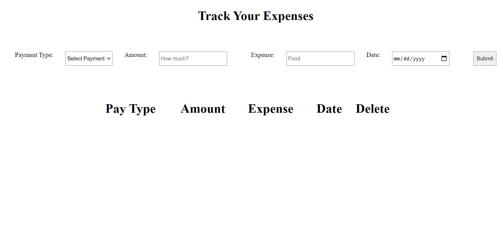

# Expense-Tracker
Simple expense tracker made with HTML, CSS and JavaScript

Try it out [here](https://cesarpreza.github.io/expense-tracker/)

# How to use

- Enter all of the required fields
  -type
  -amount
  -expense
  -date

- Click "submit"

- Data will be added to the Table below

- Click "delete" to remove an expense

# Reference Image 

# Summary

A simple but fun project. Similar to my To-Do application, only this time to manage money, the user can add expenses to the table.
taking what I learned in my previous projects I see how I've grown and how much I've learned so far. There is still so much to learn but in finishing this project
I will continue to grow and gain more and more skills. This was a fun application to make and I definitley will come back to it to refactor and add some more styling.

# Author

Cesar Preza - Software Developer [linkdin](https://www.linkedin.com/in/cesar-preza-72675278/) 
